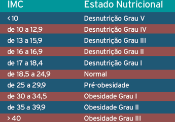

Exercícios da playlist [Lógica de Programação Virado no Jiraya](https://www.youtube.com/watch?v=ycyL5CqZoUo&list=PL62G310vn6nH-uBTKREcUWDkOi2Q9n4OZ) do DevDojo.

--------------

Lista de exercícios extra: https://docs.google.com/document/d/1yt9gyXl8GbRqqIt_WeZe4zjzKdaH_44i5_3LS8s2zSU/edit

*Exercícios para o curso Lógica de programação Virado no Jiraya
Criado por Jorge Rabello especialmente para o DevDojo <3*

#### 1) Variáveis, Tipos de Dados, Constantes, Operadores Aritméticos, Expressões

*1.1)* Baseado na fórmula abaixo escreva um programa que calcule e apresente a área de um círculo.
   
$A = \Pi R^2$

Onde:
 	$A$ representa a área do círculo
  	$\Pi$ = 3.141592654
	$R$ = Raio do círculo (deve ser fornecido pelo usuário)

*1.2)* Baseado nas fórmulas abaixo, desenvolva uma rotina que calcule o salário líquido de um funcionário. Após o cálculo o programa deve apresentar o salário base e o salário líquido calculado.   
   
$SB = HT * VH$
$TD = (PD / 100) * SB$
$SL = SB  - TD$

Onde:
   $SB$ =  Salário Base
   $HT$ = Horas Trabalhadas
	$VH$ = Valor Hora de trabalho
	$TD$ = Total de Descontos
   $PD$ = Percentual de Desconto
   $SL$ = Salário Líquido

*1.3)* Escreva um programa que realize a conversão de graus Celsius (C)  para graus Fahrenheit (F). Utilize a fórmula abaixo:

$F = (9 \times C) \div 5$

Nota: Essa fórmula está errada. A fórmula correta é $F = (9 \times C + 160) \div 5$ ou $(C \times 9 \div 5) + 32$.

*1.4)* Escreva um programa que realize a conversão de graus Fahrenheit (F)  para graus Celsius (C). Utilize a fórmula abaixo:

$C = ((F - 32) \times 5) \div 9$

*1.5)* Escreva uma rotina capaz de calcular e apresentar o valor do volume de uma lata de óleo, utilize a fórmula abaixo.

$V = \pi R^2 \times A$

Onde:
	$V$ = Volume
	$\pi$ = 3.141592654
	$R$ = Raio da circunferência da lata
	$A$ = Altura da lata

OBS: O volume deve ser apresentado com a unidade de medida correto $cm^3$.

*1.6)* Efetuar o cálculo de quantos litros de combustível um automóvel consome em uma viagem. Sabendo que o automóvel tem uma autonomia de 12 Km por litro de combustível, desenvolva o cálculo utilizando a fórmula abaixo:

$D = T \times V$
$LU = D \div 12$

Onde: 
	$D$ = Distância em Km
	$T$ = Tempo gasto na viagem
	$V$ = Velocidade

*1.7)* Ler valores para as variáveis x e y, trocar os valores das variáveis e apresentar o resultado dos valores invertidos.

*1.8)* Calcular e apresentar o valor de uma prestação em atraso, utilize a fórmula abaixo:

$P = VALOR + (VALOR \times (TAXA \div 100) \times TEMPO)$

Onde P é o valor da prestação em atraso.

*1.9)* Desenvolver um programa que apresente e calcule o volume de uma caixa retangular, utilize a fórmula abaixo:

$V = C \cdot L \cdot A$

Onde:
	$V$ = Volume em $cm^3$
	$C$ = Comprimento
	$L$ = Largura 
	$A$ = Altura

*1.10)* Fazer a leitura de um valor numérico inteiro e apresentar o valor do número elevado ao quadrado, ao cubo e a 10, apresentar também a soma total dos três resultados anteriores.

*1.11)* Elaborar um programa que realize a conversão de US\$ para R\$, o programa deve saber qual o valor da cotação do dólar e fazer a conversão.

*1.12)* Elaborar um programa que realize a conversão de R\$ para US\$, o programa deve saber qual o valor da cotação do dólar e fazer a conversão.

*1.13)* Elaborar um programa que leia o salário base mensal (SB) de um funcionário e o percentual de reajuste (PR) e calcule e apresente o novo valor de salário do funcionário. A fórmula abaixo é uma sugestão de como esse cálculo pode ser feito:

$NS = SB + (SB * PR) \div 100$

Onde:
		$NS$ = Novo Salário
      $SB$ = Salário Base
	   $PR$ = Percentual de Reajuste

*1.14)* Desenvolva uma rotina que leia dois valores numéricos inteiros e apresente o resultado das quatro operações aritméticas básicas (adicao, subtracao, multiplicacao e divisao).

*1.15)* Construa um programa que calcule a velocidade em metros por segundo de um projétil que percorre uma distância em quilômetros a um espaço de tempo em minutos, utilize a fórmula abaixo:

$V = (D \cdot 1000) \div (T \cdot 60)$

Onde:
	$V$ = Velocidade em m/s
	$D$ = Distância
	$T$ = Tempo

*1.16)* Elabore uma rotina que apresente o valor do volume de uma esfera, utilize a fórmula abaixo:

$V = (4 \div 3)\Pi(R^3)$

Onde:
$V$ = Volume
$\Pi$ = 3.141592654
$R$ = Raio

Nota: Essa fórmula está errada. A fórmula correta é $V = (4 \cdot \Pi \cdot R^3) \div 3$.

*1.17)* Sabendo que 1 ft é igual a 0,3048 m ou 30,48 cm, desenvolva um programa que leia uma medida em pés e calcule o equivalente em metros.

*1.18)* Desenvolva uma rotina que dado um número inteiro qualquer calcule seu antecessor e seu sucessor.

*1.19)* Na eletrônica existem diversas unidades de medida algumas delas são:

| Unidade | Símbolo | O que mede           | Símbolo Aritmético |
|---------|---------|----------------------|--------------------|
| Ampére  | A       | Corrente elétrica    | I                  |
| Volt    | V       | Tensão elétrica      | U                  |
| Ohm     | $\Omega$  | Resistência elétrica | R                  |
| Watt    | W       | Potência elétrica    | P                  |

Baseado nesses símbolos, existem alguns cálculos que podemos fazer utilizando a Lei de Ohm, que diz que tendo ao menos dois valores pode-se encontrar o terceiro.

Sendo assim:

A) Em um circuito elétrico temos as seguintes informações:
275 V e 10 A, calcule a resistência elétrica, utilizando a fórmula abaixo:

$R = \frac{U}{I}$

Onde:
	$R$ = Resistência em Ohms
	$U$ = Tensão em Volts
	$I$ = Corrente em Ampere

   BÔNUS: Altere o programa acima e permita que o usuário digite os valores para Volts e Amperes

B) Em um circuito elétrico temos as seguintes informações: 275 $\Omega$ e 1 A, calcule a tensão elétrica, utilizando a fórmula abaixo:

$U = R \cdot I$

Onde:
	$U$ = Tensão em Volts
	$R$ = Resistência em Ohms
	$I$ = Corrente em Amperes

BÔNUS: Altere o programa acima e permita que o usuário digite os valores para Ohms  e Amperes.

D) Ainda podemos realizar o cálculo de potência elétrica, desenvolva um rotina que calculo a potência de um equipamento, utilizando os dados e a fórmula a seguir:

Dados: 220 V  e 25 A

Fórmula:
$P = U \cdot I$

Onde: 
	$P$ = Potência em Watts
	$U$  = Tensão em Volts
	$I$ = Corrente em Amperes
   
BÔNUS: Altere o programa acima e permita que o usuário digite os valores para Volts  e Amperes.

#### 2) Estruturas de Decisão

*2.1)* Desenvolva um rotina que leia as notas de quatro bimestres de um aluno (N1, N2, N3 e N4), e informe o status do aluno baseado na tabela abaixo:

| Média                       | Status      |
|-----------------------------|-------------|
| Se a média for menor que 50 | REPROVADO   |
| Se a média for igual a 50   | RECUPERAÇÃO |
| Se a média for maior que 50 | APROVADO    |

*2.2)* Desenvolva uma rotina que dados três números inteiros, apresente-os em ordem crescente

*2.3)* Desenvolva a leitura de cinco valores numéricos inteiros e apresente somente os que forem divisíveis por 2 ou por 3

*2.4)* Escreva um programa que dados cinco valores numéricos inteiros apresente apenas o maior e o menor deles

*2.5)* Desenvolva um programa que execute a leitura de um valor numérico inteiro, caso o valor esteja entre 1 e 9 apresentar a mensagem “Dentro do valor permitido”e caso contrário apresentar a mensagem  “Fora do Valor Permitido”.

*2.6)* Leia um número inteiro qualquer  e multiplique por 2, apresentar o resultado da multiplicação  somente se o resultado for maior ou igual a 30.

*2.7)* Crie uma calculadora que seja capaz de realizar as quatro operações básicas. Para tal cumpra-se os seguintes requisitos:

a) A calculadora deve apresentar um menu e perguntar qual a operação desejada (+, -, * ou /).

b) A calculadora deve solicitar os dois valores numéricos, realizar a operação e exibir o resultado.

*2.8)* Desenvolva uma calculadora de IMC (Índice de Massa Corporal), após realizado o cálculo classificar o paciente de acordo com a tabela abaixo.

Para realizar o cálculo de IMC utilize a fórmula abaixo:

$IMC = \frac{PESO}{ALTURA^2}$

#### 3) Laços de Repetição

*3.1)* Elaborar um programa que apresente os quadrados dos números inteiros existentes na faixa de valores de 15 até 200.

*3.2)* Elaborar um programa que calcule e apresente a tabuada de um número qualquer.

*3.3)* Elaborar um programa que apresente o somatório dos números na faixa de 1 até 500.

*3.4)* Elaborar uma rotina que apresente todos os números pares na faixa de 0 até 100.

*3.5)* Elaborar um programa que apresente a sequência de Fibonacci até o décimo quinto termo.

*3.6)* Elaborar um programa que calcule o fatorial de um número inteiro

*3.7)* Melhorar o programa acima fazendo com que leia 5 números inteiros e calcule o fatorial dos 5 valores lidos.

*3.8)* Desenvolva um programa que dado um número inteiro apresente as tabuadas do 1 ao 10 desse número.

*3.9)* Melhore a calculadora desenvolvida anteriormente acrescentando as seguintes funcionalidades:

a) Sempre ao final de um cálculo a calculadora deve mostrar o menu novamente.

b) Acrescentar uma opção para sair da calculadora, como sugestão, quando o usuário digitar 0 (zero) por exemplo, a calculadora deve ser encerrada.

*3.10)* Apresentar ao usuário uma tela solicitando um login e depois uma senha, o usuário e senha corretos devem estar armazenados em constantes no seu programa. Se o usuário acertar o usuário e a senha exibir a mensagem ACESSO CONCEDIDO, caso contrário exibir a mensagem ACESSO NEGADO e voltar a pedir o usuário e senha, essa condição deve-se repetir até que o usuário acerte a combinação.

*3.11)* Equação de Pell

A equação de Pell permite encontrar o resultado de uma operação de raiz quadrada apenas com subtrações sucessivas.

Exemplo
$\sqrt{27 =??}$

Para obter a raiz quadrada de 27 procedemos da seguinte forma:

1. $27 - 1 = 26$
2. $26 - 3 = 23$
3. $23 - 5 = 18$
4. $18 - 7 = 11$
5. $11 - 9 = 2$

Veja que 5 passos foram tomados sendo assim temos a parte inteira da raiz. Logo podemos dizer que

$\sqrt{27 = 5}$

Desenvolva um programa que dado um número inteiro qualquer utilize a equação de Pell e calcule a parte inteira do resultado da raiz quadrada deste número.

BÔNUS: Ainda utilizando a Equação de Pell existe uma forma de calcular os dígitos após a vírgula, tente incrementar o seu programa, acrescentando essa funcionalidade.

#### Vetores

*4.1)* Armazenar em dois vetores V1 e V2 9 valores numéricos inteiros e exibir o resultado da multiplicação dos números do V1 com os correspondentes em V2
Exemplo:
| V1 | 1 | 2 | 3  | 4  | 5  | 6  | 7  | 8  | 9 |
|----|---|---|----|----|----|----|----|----|---|
| V2 | 2 | 3 | 4  | 5  | 6  | 7  | 8  | 9  | 0 |
| VR | 2 | 6 | 12 | 20 | 30 | 42 | 56 | 72 | 0 |

*4.2)* Calculando Dígito Verificador de um CPF.

O CPF (Cadastro de Pessoas Físicas) é composto por 11 dígitos ao todo, porém os 2 últimos dígitos são calculados, essa informação serve para determinarmos por exemplo, se um cpf é ou não válido.

Para calcular um CPF existem alguns passo que precisam ser seguidos, veja abaixo:

Vamos tomar como exemplo o CPF fictício 728.316.240-29, para calcular seus DVs vamos fazer as seguintes operações.

Calculando o DV1

| Dígito do CPF |  7 |  2 |  8 |  3 | 1 |  6 | 2 |  4 | 0 | DV1 |
|---------------|:--:|:--:|:--:|:--:|:-:|:--:|:-:|:--:|:-:|:---:|
| Multiplicador | 10 |  9 |  8 |  7 | 6 |  5 | 4 |  3 | 2 |     |
| Resultado     | 70 | 18 | 64 | 21 | 6 | 30 | 8 | 12 | 0 |     |

Agora deve-se somar os resultados
$70+18+64+21+6+30+8+12+0= 229$

Agora deve-se calcular o módulo de 229 por 11, sendo assim:
$229 % 11 = 9$

E por fim deve-se subtrair esse resultado de 11, ou seja:
$11 - 9 = 2$

Se o resultado da subtração for maior que 9, o dígito verificador é ZERO. Caso contrário, o dígito verificador é o resultado dessa subtração. Neste caso, o primeiro dígito verificador é 2.

E temos o primeiro dígito verificador

| CPF | 7 | 2 | 8 | 3 | 1 | 6 | 2 | 4 | 0 | 2 |
|-----|:-:|:-:|:-:|:-:|:-:|:-:|:-:|:-:|:-:|:-:|

Agora devemos calcular o segundo dígito verificador da seguinte forma

| Dígito do CPF |  7 |  2 |  8 |  3 | 1 |  6 |  2 |  4 | 0 | 2 |
|---------------|:--:|:--:|:--:|:--:|:-:|:--:|:--:|:--:|:-:|:-:|
| Multiplicador | 11 | 10 |  9 |  8 | 7 |  6 |  5 |  4 | 3 | 2 |
| Resultado     | 77 | 20 | 72 | 24 | 7 | 36 | 10 | 16 | 0 | 4 |

Agora deve-se somar os resultados

$77+20+72+24+7+36+10+16+0+4=266$

Agora deve-se calcular o módulo de 229 por 11, sendo assim:

$266 % 11 = 2$

E por fim deve-se subtrair esse resultado de 11, ou seja:
$11 - 2 = 9$

Se o resultado da subtração for maior que 9, o dígito verificador é ZERO. Caso contrário, o dígito verificador é o resultado dessa subtração. Neste caso, o primeiro dígito verificador é 9.

E temos o segundo dígito verificador

| CPF | 7 | 2 | 8 | 3 | 1 | 6 | 2 | 4 | 0 | 2 | 9 |
|-----|:-:|:-:|:-:|:-:|:-:|:-:|:-:|:-:|:-:|:-:|:-:|

Uma vez entendido o problema escreva um programa que dados os 9 primeiros dígitos de um CPF calcule os dois dígitos verificadores.

#### 5) Métodos/Funções

*5.1)* Melhore a calculadora dividindo cada operação em métodos/funções

*5.2)* Acrescente a calculadora as operações de potência e raiz quadrada (resultado inteiro utilizando a equação de Pell)

*5.3)* Escreva um programa que tenha as seguinte funcionalidades

a) O programa deve apresentar um menu com as opções de conversão, de exibição da memória e também uma opção para encerrar o programa.

b) Faça a conversão de Graus Celsius para Fahrenheit 

c) Faça a conversão de Graus Fahrenheit para Celsius.

d) O programa deve armazenar as 5 últimas operações e permitir exibir essa operação a qualquer momento.

*5.4)* Melhore o programa da Lei de Ohm exibindo um menu com as seguintes funcionalidades:

a) Calcular Tensão Elétrica
b) Calcular Resistência Elétrica
c) Calcular Corrente Elétrica
d) Calcular Potência Elétrica
e) Sair

O programa deve realizar os cálculos e exibir os resultados, ao fim de cada cálculo deve-se retornar ao menu.

*5.5)* Desenvolva um programa que apresente um menu com as seguintes opções:

a) Realizar venda
Para realizar a venda basta informar o valor do produto e acrescentar 25% de comissão para o vendedor  e 65% de impostos e taxas e exibir o resultado total.

b) Calcular pagamento a vista
Basta informar o valor a pagar e conceder um desconto de que não pode ser maior que 15%. O vendedor deve poder informar o percentual de desconto.

c) Calcular pagamento parcelado
Basta informar o valor a pagar e quantidade de parcelas, para cada parcela acrescentar 2% ao valor a ser pago, a quantidade de parcelas não deve ser nem menor que três e nem maior que 36.

d) Calcular prestação em atraso
Para calcular uma prestação em atraso utilizar a seguinte fórmula:

$P = V + (V \times (T \div 100) \times D)$

Onde:
   $P$ = Valor da prestação a ser pago
   $V$ = Valor atual da prestação	
	$T$ = Taxa
	$D$ = Dias em atraso

e) O programa deve armazenar o total das 5 últimas vendas e permitir que se visualize o total de vendas somando os valores dessas 5 últimas.

f) Sair
Essa opção deve apenas encerrar o programa.

